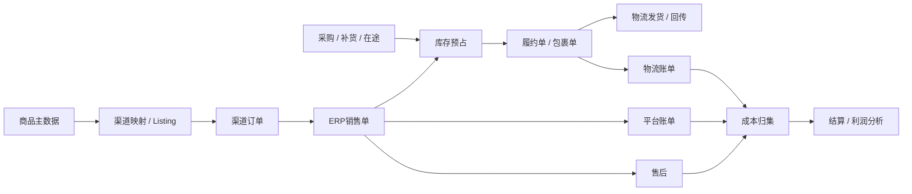
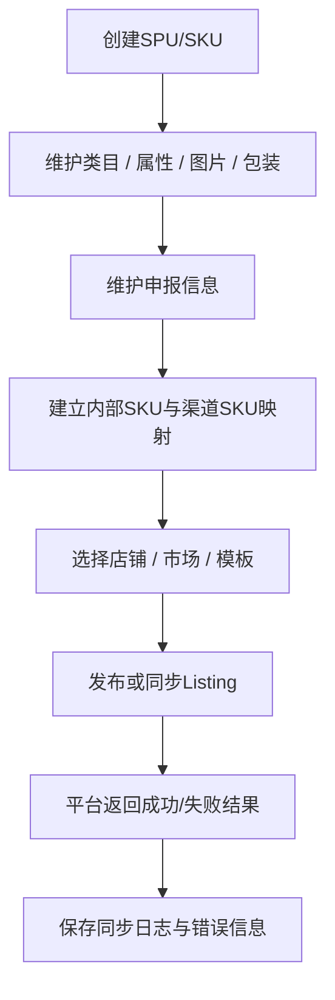
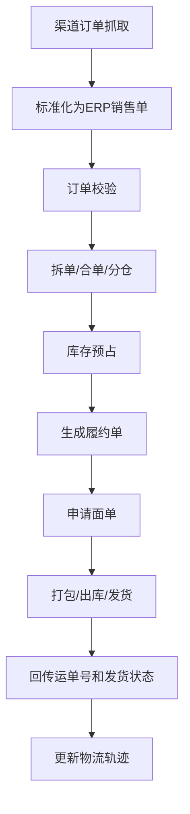
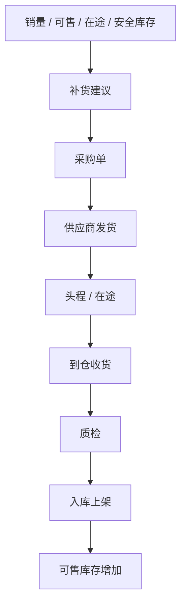
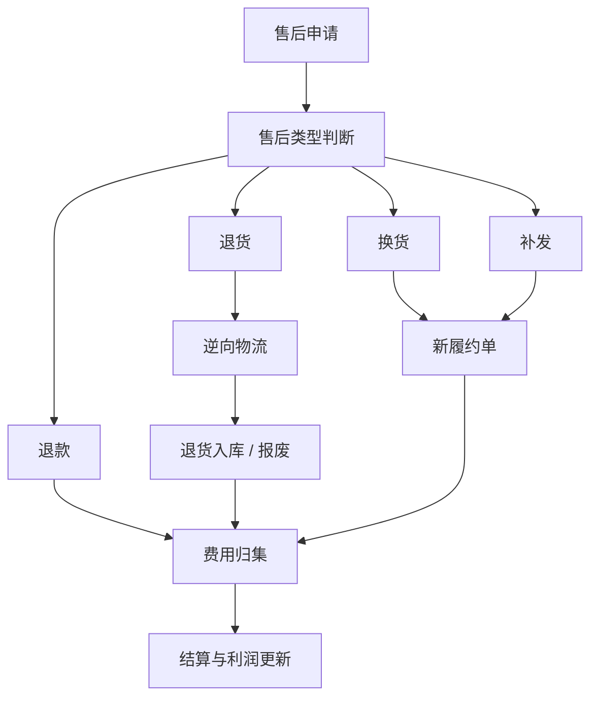
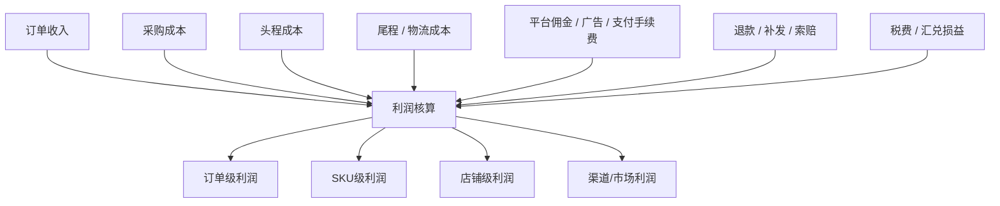

# 跨境ERP业务术语表与流程图手册

更新时间：2026-04-24  
编写依据：
- `D:\Project\erp\自研跨境ERP源码与技术栈参考分析报告-2026-04-24.md`
- `D:\Project\erp\自研跨境ERP需求分析说明书.md`
- `D:\Project\erp\跨境业务知识指南和开源项目资源参考.md`

---

## 1. 文档目的

这份手册用于统一跨境 ERP 项目中的业务术语、对象定义和核心流程理解，适合产品、研发、测试、实施、运营和财务协作时共同使用。

建议把它当作：

- 项目启动时的统一语言文档
- 需求评审前的背景材料
- 研发和测试对齐对象模型的参考
- 新成员培训手册

---

## 2. 使用规则

## 2.1 术语使用原则

- 业务口语可以保留，但系统字段名必须标准化
- 同一个词只能尽量对应一个明确对象
- 如果同一个词在团队里有歧义，应以本手册定义为准

## 2.2 流程图阅读原则

- 流程图优先表达“对象流动”和“状态变化”
- 不在流程图里堆所有异常分支
- 复杂异常由状态机和业务规则补充说明

---

## 3. 核心术语表

## 3.1 组织与权限术语

| 术语 | 英文/别名 | 定义 | 备注 |
|---|---|---|---|
| 租户 | Tenant | 使用系统的独立业务主体 | SaaS 场景尤其重要 |
| 组织 | Organization | 公司、部门、岗位等管理结构 | 权限和数据归属基础 |
| 公司 | Company | 独立经营或核算主体 | 可对应法人或业务实体 |
| 部门 | Department | 组织内的业务单元 | 如运营、采购、仓储 |
| 角色 | Role | 权限集合 | 如运营、财务、客服 |
| 数据权限 | Data Permission | 用户可见和可操作的数据范围 | 不等于菜单权限 |
| 审计日志 | Audit Log | 关键操作留痕记录 | 必须可追溯 |

## 3.2 商品与 Listing 术语

| 术语 | 英文/别名 | 定义 | 备注 |
|---|---|---|---|
| SPU | Standard Product Unit | 标准化商品单元 | 偏商品抽象层 |
| SKU | Stock Keeping Unit | 最小可销售库存单元 | 内部经营主键 |
| 渠道 SKU | Seller SKU / Listing SKU | 平台侧商品标识 | 不能替代内部 SKU |
| 父体 | Parent | 变体关系中的父级商品 | 平台上常见 |
| 子体 | Child | 变体关系中的子级商品 | 对应具体可售变体 |
| Listing | Listing | 渠道上的商品呈现单元 | 包含标题、价格、库存等 |
| 类目 | Category | 商品分类 | 平台类目和内部类目可能不同 |
| 属性 | Attribute | 商品特征字段 | 如颜色、尺码、材质 |
| 申报信息 | Customs Declaration | 报关/清关相关字段 | 名称、价格、材质、用途等 |
| HS Code | HS Code | 海关编码 | 影响关务和税费 |

## 3.3 渠道与市场术语

| 术语 | 英文/别名 | 定义 | 备注 |
|---|---|---|---|
| 渠道 | Channel | 外部销售来源 | Amazon、Shopify、TikTok Shop 等 |
| 店铺 | Store / Shop | 渠道下的具体销售账号 | 订单和 Listing 的归属入口 |
| 站点 | Site | 平台下的区域市场 | 如 Amazon US、Amazon DE |
| 市场 | Market | 区域、品牌、国家等经营维度 | 可比站点更宽 |
| 授权 | Authorization | 店铺与平台接口的连接过程 | 含 Token 生命周期 |
| 渠道回调 | Webhook Callback | 平台主动推送状态或事件 | 需幂等处理 |

## 3.4 订单与履约术语

| 术语 | 英文/别名 | 定义 | 备注 |
|---|---|---|---|
| 渠道订单 | Channel Order | 平台原始订单 | 原文必须保留 |
| ERP 销售单 | ERP Sales Order | ERP 内部标准化单据 | 承载经营语义 |
| 履约单 | Fulfillment Order | 仓储与物流执行单据 | 可一对多包裹 |
| 包裹单 | Package | 实际发运包裹对象 | 含运单号、物流产品 |
| 拆单 | Split Order | 一个订单拆成多个执行单 | 常因分仓或商品规则 |
| 合单 | Merge Order | 多个订单合并执行 | 常因收件信息一致等 |
| 异常单 | Exception Order | 无法正常流转的订单 | 需人工干预或重试 |
| 回传 | Push Back | 发货、轨迹、状态回写平台 | 是平台履约闭环关键 |

## 3.5 库存与仓储术语

| 术语 | 英文/别名 | 定义 | 备注 |
|---|---|---|---|
| 在手库存 | On Hand | 当前已实物在仓库存 | 不等于可售库存 |
| 预占库存 | Reserved | 已为订单保留的库存 | 会影响可售 |
| 可售库存 | Available | 可继续销售的库存 | 常为核心同步字段 |
| 在途库存 | In Transit | 采购/调拨/头程运输中的库存 | 对补货很关键 |
| 不良库存 | Defective | 不可销售库存 | 如破损、质检不合格 |
| 调拨 | Transfer | 仓与仓之间转移库存 | 可跨仓或跨国家 |
| 盘点 | Stock Count | 实物库存核对 | 影响库存调整 |
| 库龄 | Aging | 库存存放时长 | 影响周转和资金占用 |
| 波次 | Wave | 批量拣货执行单元 | WMS 常见概念 |
| 组套 | Kit / Bundle | 多个 SKU 组合销售或执行 | 需处理库存关系 |

## 3.6 采购与供应链术语

| 术语 | 英文/别名 | 定义 | 备注 |
|---|---|---|---|
| 采购单 | Purchase Order | 向供应商下单的单据 | 采购起点 |
| 收货单 | Receiving Order | 货物到仓接收单据 | 与入库关联 |
| 质检单 | QC Order | 质量检验单据 | 不合格品需隔离 |
| 供应商 | Supplier | 供货方 | 补货周期和价格来源 |
| 安全库存 | Safety Stock | 为防断货保留的库存下限 | 补货计算要素 |
| 补货建议 | Replenishment Suggestion | 系统给出的补货结果 | 需结合销量、在途、周期 |
| MOQ | Minimum Order Quantity | 最小起订量 | 采购约束条件 |

## 3.7 履约与物流术语

| 术语 | 英文/别名 | 定义 | 备注 |
|---|---|---|---|
| 自发货 | MFN / Merchant Fulfilled | 卖家自行履约发货 | 与 FBA 相对 |
| FBA | Fulfillment by Amazon | 亚马逊官方仓配模式 | 特殊履约逻辑 |
| 海外仓 | Overseas Warehouse | 位于海外市场的本地仓 | 可自营或第三方 |
| 3PL | Third-Party Logistics | 第三方仓配服务商 | 外部履约连接器 |
| 头程 | First Mile / Inbound Logistics | 从国内到海外仓/FBA 的运输 | 重要成本项 |
| 尾程 | Last Mile | 最后一段配送 | 影响体验和时效 |
| 面单 | Shipping Label | 运单标签 | 打单和出库核心对象 |
| 运单号 | Tracking Number | 包裹物流标识 | 轨迹查询关键 |
| 妥投 | Delivered | 成功签收状态 | 常用于客服和财务判断 |
| 拒收 | Refused | 买家拒绝签收 | 常触发售后或逆向物流 |

## 3.8 售后与逆向术语

| 术语 | 英文/别名 | 定义 | 备注 |
|---|---|---|---|
| 退款 | Refund | 将款项退回买家 | 不一定退货 |
| 退货 | Return | 买家把货退回 | 可能影响库存回流 |
| 换货 | Exchange | 退回后重新发新货 | 涉及逆向和新履约 |
| 补发 | Reship | 原订单异常后重发商品 | 常形成新履约单 |
| 索赔 | Claim | 向物流商/平台/仓库追偿 | 费用和责任事件 |
| 逆向物流 | Reverse Logistics | 退货、换货、退仓链路 | 不能只看客服状态 |

## 3.9 结算与财务术语

| 术语 | 英文/别名 | 定义 | 备注 |
|---|---|---|---|
| 平台账单 | Platform Statement | 平台结算或费用账单 | 利润分析主要输入 |
| 物流账单 | Logistics Statement | 承运商或仓储服务账单 | 履约成本输入 |
| 平台佣金 | Platform Fee / Commission | 平台向卖家收取的服务费用 | 常按订单归集 |
| 广告成本 | Ad Spend | 投流和广告费用 | 影响 SKU/店铺利润 |
| 支付手续费 | Payment Fee | 支付收款相关成本 | 独立成本项 |
| 税费 | Tax / VAT / GST | 销售或清关相关税费 | 受市场和政策影响 |
| 汇兑损益 | FX Gain/Loss | 汇率变动形成的收益/损失 | 跨境常见 |
| 结算单 | Settlement Sheet | 汇总业务与费用后的结算结果 | 可对账、可复核 |
| 毛利 | Gross Profit | 收入减直接成本 | 不等于最终净利 |
| 净利 | Net Profit | 扣除更多成本后的最终利润 | 决策更关键 |

## 3.10 集成与研发术语

| 术语 | 英文/别名 | 定义 | 备注 |
|---|---|---|---|
| 连接器 | Connector | 与外部系统交互的适配组件 | 渠道、物流、支付都可有连接器 |
| Webhook | Webhook | 外部系统主动推送事件 | 需要验签和幂等 |
| 幂等 | Idempotency | 重复调用不会产生重复结果 | 外部接口基础要求 |
| 重试 | Retry | 调用失败后的再次执行 | 应有上限和策略 |
| 补偿 | Compensation | 某步骤失败后的修复动作 | 工作流能力 |
| 回放 | Replay | 对原始请求或消息重做 | 排错和补数据必备 |
| 工作流 | Workflow | 多步骤、多系统的编排逻辑 | 不应散在各控制器里 |
| 死信 | Dead Letter | 多次失败后的待人工处理消息 | 消息治理常见 |

---

## 4. 黑话与标准术语映射

| 黑话 | 推荐标准术语 | 说明 |
|---|---|---|
| 铺货 | 批量发布 Listing | 偏运营口语 |
| 链接 | Listing / 渠道商品 | 团队里经常这样叫 |
| 拉单 | 订单同步 | 平台抓单 |
| 推单 | 状态推送 / 数据推送 | ERP 推给外部系统 |
| 吞单 | 订单同步异常 | 订单丢失或未落库 |
| 卡单 | 订单流转异常 | 停在某状态不动 |
| 打单 | 面单申请与打印 | 履约动作 |
| 跑量 | 销量导向策略 | 不一定利润优先 |
| 跑利润 | 利润导向策略 | 控制成本和投放 |
| 回款 | 收款结算事件 | 财务口语 |
| 归单 | 成本归集到订单/SKU | 财务核算动作 |
| 补数据 | 数据重放/修复 | 运维和研发常用 |

---

## 5. 核心流程图

## 5.1 跨境经营总链路

## 5.2 商品到 Listing 流程

## 5.3 订单到履约流程

## 5.4 采购补货流程

## 5.5 售后逆向流程

## 5.6 结算与利润流程

---

## 6. 常见易混术语对比

| 易混术语 | 区别 |
|---|---|
| SKU vs 渠道 SKU | SKU 是内部经营主键，渠道 SKU 是外部映射标识 |
| 店铺 vs 市场 | 店铺是账号，市场是经营区域/维度 |
| 渠道订单 vs ERP 销售单 | 前者保留平台原貌，后者承载内部经营语义 |
| 履约单 vs 包裹单 | 履约单是执行任务，包裹单是实际发运对象 |
| 在手库存 vs 可售库存 | 在手不等于可售，可售还要扣除预占和异常库存 |
| 退款 vs 退货 | 退款不一定退货，退货也不一定全额退款 |
| 毛利 vs 净利 | 毛利是初步利润，净利会扣更多成本 |
| 回调 vs 回传 | 回调是平台推给 ERP，回传是 ERP 再推回平台 |

---

## 7. 团队协作建议

- 产品写需求时，优先使用标准术语，不直接写黑话做字段名。
- 研发建模时，优先对齐对象和状态，再讨论接口和页面。
- 测试设计用例时，按“对象流转 + 状态变化 + 异常补偿”覆盖。
- 财务和运营评审时，重点确认利润口径、费用归集和售后归因。

---

## 8. 总结

跨境 ERP 项目最容易出问题的地方，不是少一个页面，而是团队对同一个词、同一个对象、同一条流程的理解并不一致。这份手册的价值就在于先统一语言，再统一流程，再统一系统模型。

如果后续继续扩展，建议在这份文档上持续补充：

- 平台特有术语，如 Amazon、Shopify、TikTok Shop 的专属术语
- 更细的状态机图
- 更细的角色操作流程
- 与数据库对象和接口对象的一一映射

